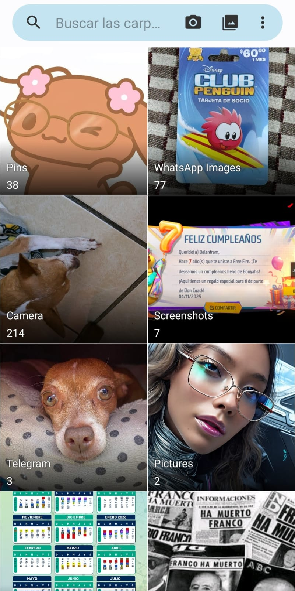
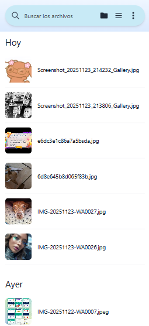
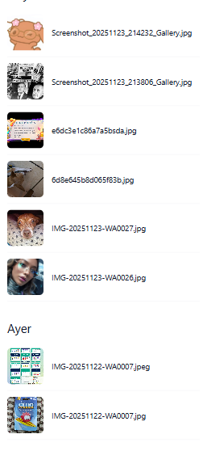

# Prueba Técnica - Galería de Fotos
**Yeimy Belen Huchim Onofre**

Descripción: Recreación de dos interfaces de una galería de fotos utilizando HTML, Tailwind CSS y Javascript.

## Instrucciones para correr localmente

### Pasos para ejecutar

1. **Clonar el repositorio:**
   ```bash
   git clone https://github.com/Belenfram/PruebaTecnicaYBHO.git
   ```

2. **Abrir el proyecto:**
   - **Vista Grid (cuadrícula):** Abre `index.html` en tu navegador
   - **Vista Lista (vertical):** Abre `photos.html` en tu navegador
   - O puedes abrir `index.html` en tu navegador y dar click en el botón de fotos para dirigirte a `photos.html`


## Vistas

Este proyecto implementa dos pantallas diferentes de una aplicación de galería:

### Vista de Álbumes (`index.html`) 
Pantalla principal que muestra las carpetas/álbumes organizados en una cuadrícula de 2 columnas. Permite navegar entre diferentes colecciones de fotos.

**App ZGallery**


**Recreación**


### Vista de Todas las Fotos (`photos.html`)
Pantalla que muestra todas las fotos individuales organizadas cronológicamente por secciones (Hoy, Ayer, etc.).

**App ZGallery**


**Recreación**



